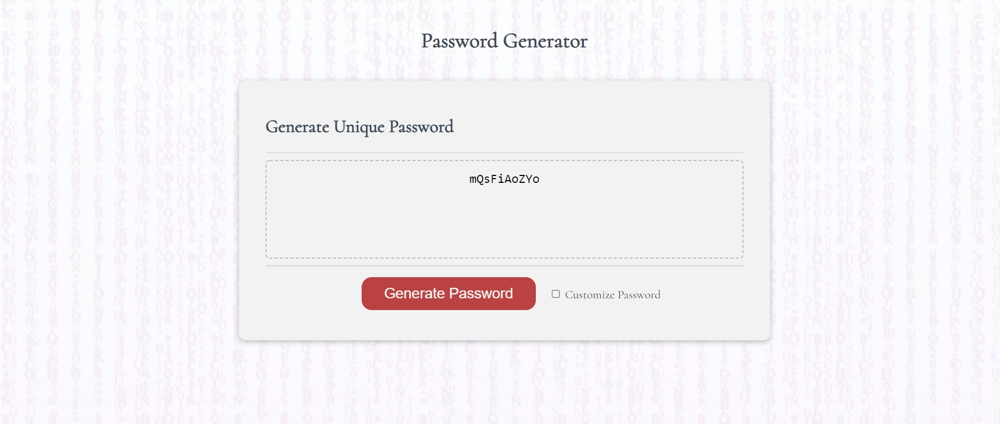
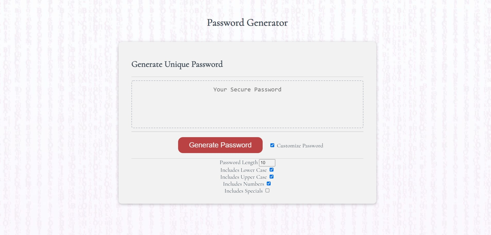
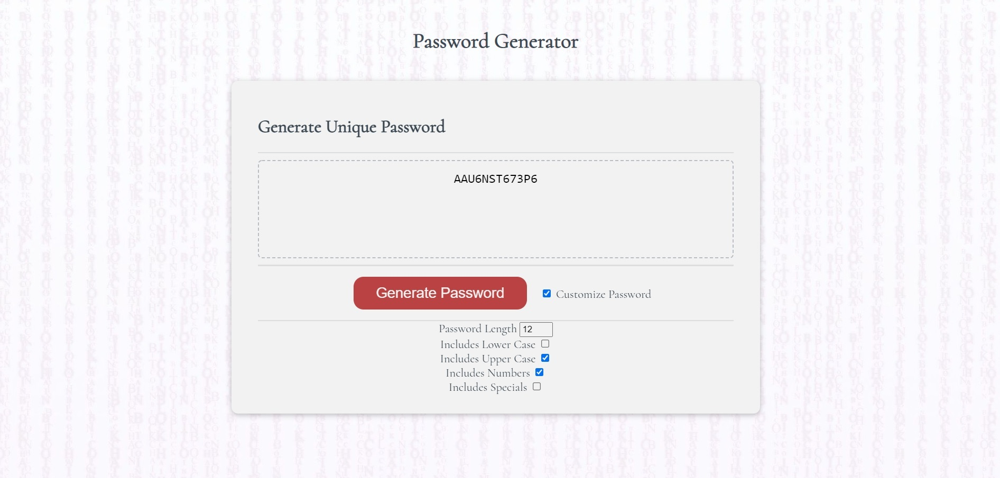

# JavaScript Password Generator
#### By Matilda Brantley 

[Live GitHub Page](https://matildabrantley.github.io/password-generator/)

## Features

* Array possibleCodes is concatenated with new character codes so that every random character is equally likely.
* Helper function getCharacterCodes() that creates and returns an array of character codes based on specified starting position and length of character code section. New character types can easily be appended to possibleCodes array this way.
* Includes special characters !, ", #, $, %, &, ', (, ), *, +, ', -, ., /, :, ;, <, =, >, ?, @, {, |, }, ~. 
* Returns error message instead of password if password parameters are invalid (too short, too long, no options selected).
* Customization options for password appear below when selected, using checkboxes for each password option.

## Screenshots

## Goals for Project
 Given I need a new, secure password:
* When I click the button to generate a password
  * Then I am presented with a series of prompts for password criteria
* When prompted for password criteria
  * Then I select which criteria to include in the password
* When prompted for the length of the password
  * Then I choose a length of at least 8 characters and no more than 128 characters
* When prompted for character types to include in the password
  * Then I choose lowercase, uppercase, numeric, and/or special characters
* When I answer each prompt
  * Then my input should be validated and at least one character type should be selected
* When all prompts are answered
  * Then a password is generated that matches the selected criteria
* When the password is generated
  *Then the password is either displayed in an alert or written to the page

#### Completed 6/17/2021